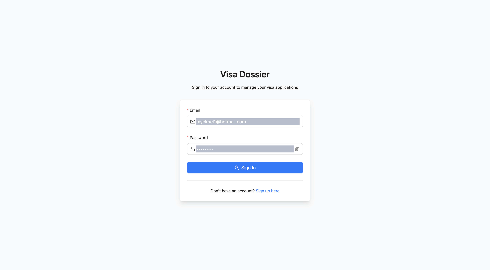
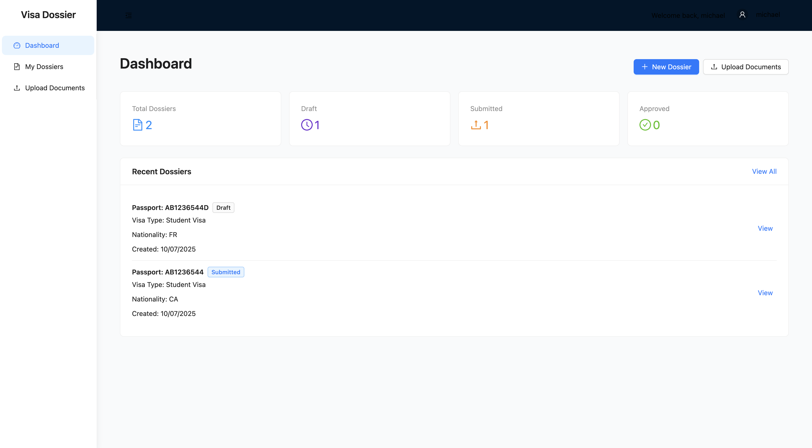
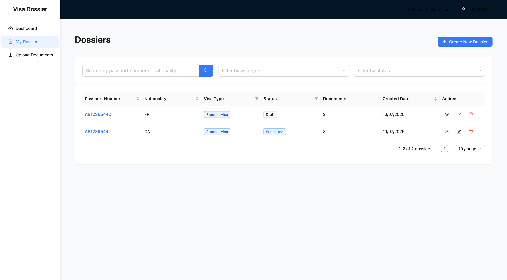
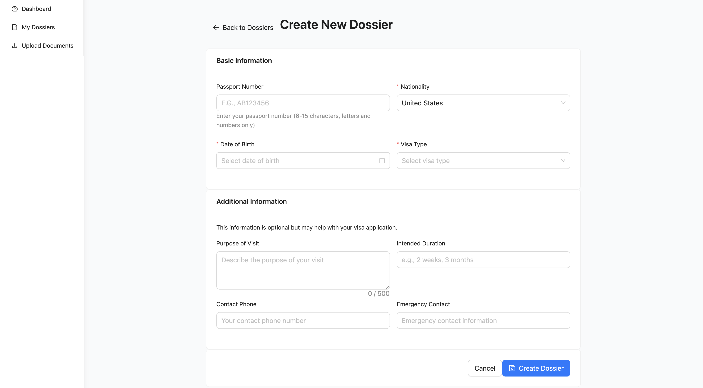
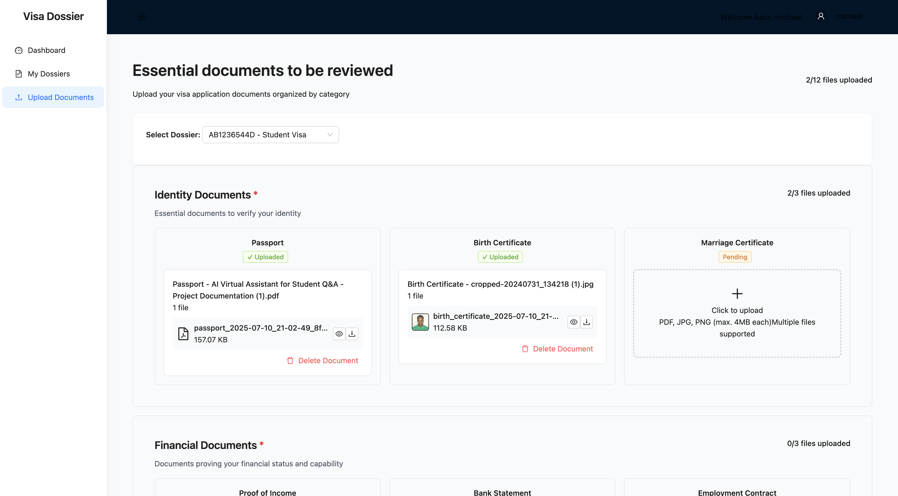

## AnchorLess Technical Assessment: VISA Dossier: Upload Feature

---

### Backend Setup (Laravel)

1. Navigate to the backend directory:
   ```sh
   cd visa_dossier/backend
   ```
2. Install PHP dependencies:
   ```sh
   composer install
   ```
3. Copy the example environment file and configure your environment variables:
   ```sh
   cp .env.example .env
   # Edit .env as needed (DB, storage, etc.)
   ```
4. Generate application key:
   ```sh
   php artisan key:generate
   ```
5. Run database migrations:
   ```sh
   php artisan migrate
   ```
6. Start the backend server:
   ```sh
   php artisan serve
   ```

---

### Frontend Setup (React + Vite)

1. Navigate to the frontend directory:
   ```sh
   cd frontend
   ```
2. Install dependencies:
   ```sh
   npm install
   # or
   yarn install
   ```
3. Start the frontend development server:
   ```sh
   npm run dev
   # or
   yarn dev
   ```

---

### Testing the Upload and Delete Features

#### Using the Frontend UI
1. Start both backend and frontend servers as described above.
2. Open the frontend app in your browser (usually at http://localhost:5173 or as indicated in the terminal).
3. Log in or register.
4. Navigate to /dossiers page through the left nav menu.
5. Click `create new dossier` and create a new dossier.
6. Find and click the Upload Documents button
8. To **upload** a file:
   - click the uploader for each listed categories to upload files.
   - Wait for the upload to complete and confirm the file appears in the list.
9. To **delete** a file:
   - Locate the file in the list.
   - Click the delete/trash icon next to the file.
   - Confirm deletion if prompted. The file should be removed from the list.

---

### Screenshots

Below are screenshots demonstrating the upload and delete features:







For any issues, please check the logs or reach out to the maintainer.